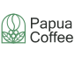
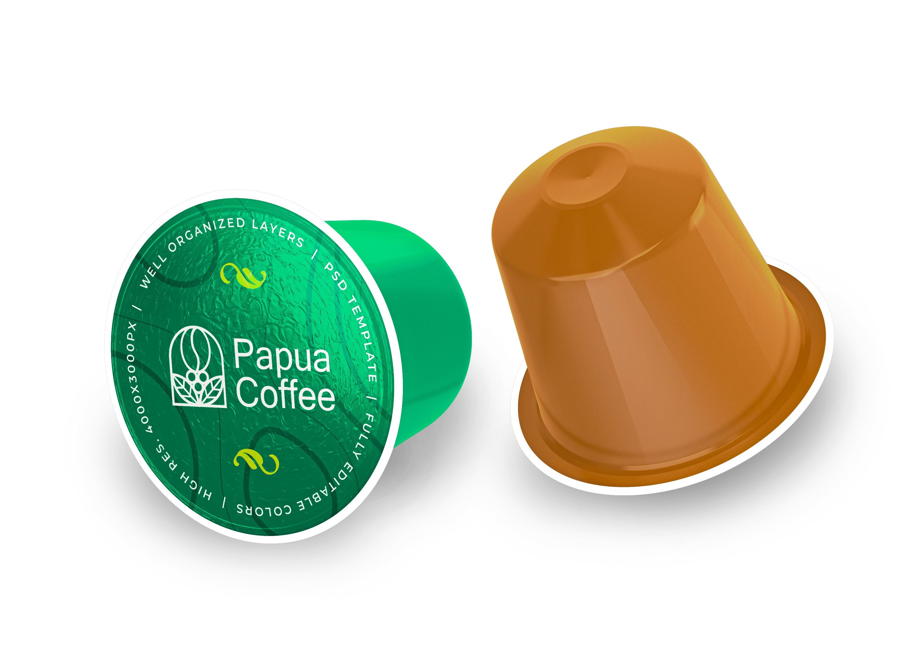

# Papua Coffee

Papua Coffee is an e-commerce website project developed in collaboration with Douglas College. It encompasses UI design and robust functionality using SASS, Material-UI, ReactJS, Node.js, Express, and Swagger for API usage and testing.

## Project Description

We collaborated on a comprehensive term project focused on the development of a fully functional e-commerce website, encompassing UI design and robust functionality. The front end of the website was meticulously crafted using SASS, Material-UI, and ReactJS. In parallel, the backend was proficiently developed using Node.js and Express, with the integration of Swagger for efficient API usage and testing. Our collaborative efforts and expertise in these technologies led to the successful implementation of a seamless and engaging online shopping platform.

We demonstrated strong team collaboration, coordinating our efforts to meet project goals and deadlines. Our commitment to being team players enabled a smooth integration of frontend and backend components, ensuring a cohesive and functional e-commerce platform. Additionally, we showcased exceptional time management skills, efficiently allocating resources and prioritizing tasks to achieve project milestones in a timely manner. These qualities were instrumental in successfully developing and delivering a high-quality, user-friendly online shopping experience.

## Features

- Frontend developed with SASS, Material-UI, and ReactJS
- Backend developed with Node.js and Express
- Integration of Swagger for API usage and testing

## Skills Utilized

- Express.js
- SASS
- Redux
- React.js
- UI/UX Design
- Node.js

